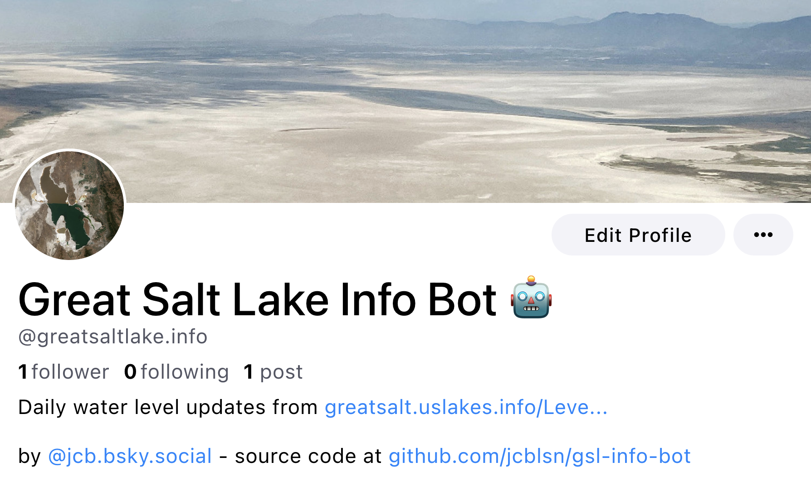

# Great Salt Lake Water Level Bot

The Great Salt Lake is [disappearing](https://www.reuters.com/business/environment/utahs-great-salt-lake-is-drying-out-threatening-ecological-economic-disaster-2022-07-14/). This repo serves as a reminder and as proof of concept for a Bluesky bot.

## Functionality

I retrieve the current water level data from NWIS data displayed [here](http://greatsalt.uslakes.info/Level.asp) and post it to Bluesky using the [atprototools](https://github.com/iandklatzco/atprototools) package. I include comparisons to the average water level 1, 2, and 10 years ago calculated using [historical data](https://nwis.waterdata.usgs.gov/usa/nwis/uv/).

Water level is reported in feet above mean sea level ([NGVD 1929](https://en.wikipedia.org/wiki/National_Geodetic_Vertical_Datum_of_1929)) for [USGS site 10010100 near Saline, UT](https://waterdata.usgs.gov/nwis/inventory/?site_no=10010100&agency_cd=USGS), which is [located](https://goo.gl/maps/brzic2aqZmYKgfcc6) at the north arm of the lake. This value varies from values recorded at other sites, particularly those from the south arm of the lake. For example, this commonly used [web app](https://webapps.usgs.gov/gsl/) uses the value for water level taken from the south arm of the lake at [USGS site 10010000 near Saltair, UT](https://waterdata.usgs.gov/monitoring-location/10010000/).

## Requirements

Required Python packages are listed in `requirements.txt`.

## Attribution

- Water level data is retrieved from the [Great Salt Lake Water Level](http://greatsalt.uslakes.info/Level.asp) website.
- Thanks to the authors of [atprototools](https://github.com/ianklatzco/atprototools) for the Python tools for Bluesky.

## License

